# ☁️ Architecting a Multi-Tier Cloud E-Commerce Stack

A high-performance, highly available e-commerce infrastructure built on AWS. This project demonstrates the deployment and configuration of a **Magento 2** environment utilizing a **"Varnish Sandwich"** architecture for enterprise-grade caching and SSL offloading.

## 🛠️ Tech Stack & Infrastructure
* **Cloud Provider:** AWS EC2 (Debian 12)
* **Web Server / Proxy:** Nginx
* **Caching Layer:** Varnish Cache 7.1
* **Application Layer:** Magento 2 via PHP 8.3-FPM
* **Database:** MySQL / MariaDB
* **Version Control:** Git

## 🏗️ Architecture Overview: The Varnish Sandwich
To maximize performance and securely handle HTTPS traffic, this environment separates routing and caching into distinct layers:

1. **Frontend Proxy (Nginx - Port 443/80):** Terminates SSL connections and acts as the initial reverse proxy.
2. **Caching Layer (Varnish - Port 8080):** Intercepts standard traffic to serve cached static and dynamic content instantly, significantly reducing backend load.
3. **Backend Server (Nginx - Port 8008):** Processes cache misses and routes PHP requests to the PHP-FPM application layer.

*(Note: Sensitive administrative paths like `/admin` and `phpMyAdmin` are routed directly from the frontend proxy to the backend server, completely bypassing the Varnish cache for security and data integrity.)*

## 🚀 Key Engineering Challenges Solved

* **Advanced Port Management & Systemd Overrides:** Configured custom `systemd` service files to bypass default port bindings, successfully isolating Varnish and Nginx on specific internal ports to prevent binding conflicts.
* **Secure Routing Exceptions:** Engineered custom Nginx location blocks to completely bypass the Varnish caching layer for sensitive administrative paths, ensuring secure, real-time database management.
* **Disaster Recovery & AWS User Data Injection:** Simulated a critical lockout scenario (lost SSH key/strict firewall). Successfully regained server access by injecting a break-glass Bash script via AWS EC2 User Data to force password resets, bypass strict SSH key requirements, and extract a clean database dump using the `--no-tablespaces` flag to navigate MySQL privilege errors.

## 📂 Repository Contents
* `/configs`: Contains the production-ready `nginx-magento.conf` and `varnish-default.vcl` files demonstrating the reverse proxy and caching logic.
* `/scripts`: Contains the AWS EC2 rescue script (`ec2-rescue-script.sh`) used for emergency access and credential resetting.
* `/docs`: Contains the detailed Enterprise Deployment runbook and architectural diagrams.
